<p align="center">
  
</p>

<p align="center"><em>A colour for every node. Less squinting, more gold.</em></p>

# GM2 NodeTint

If you've ever flown circles over a cluster of herb pins trying to work out which one is the Azeroot and which is the *fifth* Tranquility Bloom of your route, this is for you.

GM2 NodeTint paints every gathering node its own colour on top of GatherMate2's pins, so you can tell them apart at a glance — on the world map when you're planning, and on the minimap at the precise moment of "do I land or not?". Built primarily for Mining and Herbalism gold runs; everything else GatherMate2 tracks (Fishing, Treasure, Logging, Extract Gas, Archaeology) comes along for the ride.

**GM2 NodeTint is a companion addon for [GatherMate2](https://www.curseforge.com/wow/addons/gathermate2).** It does not replace GatherMate2 — it sits on top of it, hooks the existing pin pipeline, and adds colour. GatherMate2 is a hard dependency; GMNT cannot run on its own.

## See the difference (minimap)

<p align="center">
  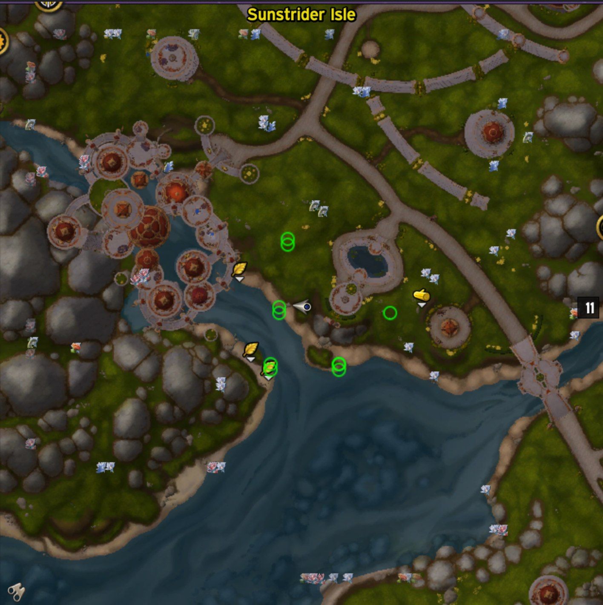
  &nbsp;
  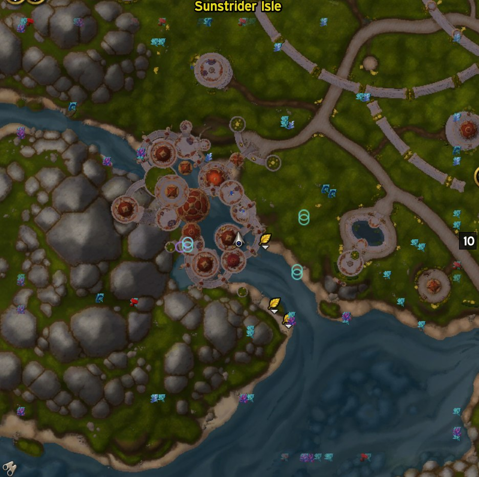
  &nbsp;
  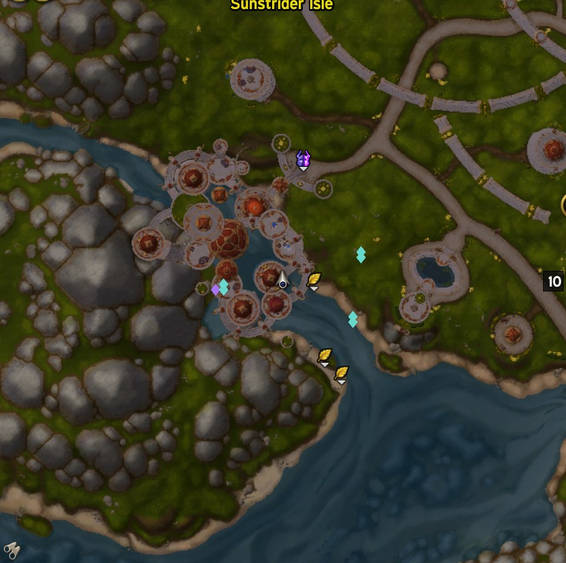
</p>

<p align="center"><em>GatherMate2 alone (left): every herb pin is a green leaf, every ore pin is a brown lump — they're all the same shape, same hue. GMNT default (centre): same icon style, but each individual node type gets its own colour. GMNT vivid (right): neutral icon mode plus targeted filtering for maximum contrast.</em></p>

Want to cut the visual noise even further? GatherMate2 has its own filter dialog where you can hide node types you don't currently care about. Pair it with GMNT's per-node colour and you can say "show me Azeroot, Mana Lily, and Tranquility Bloom only — and paint each a different colour" for a focused farming view.

<p align="center">
  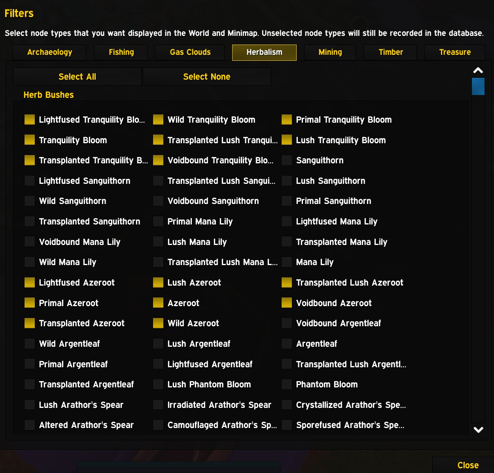
</p>

## And on the world map

<p align="center">
  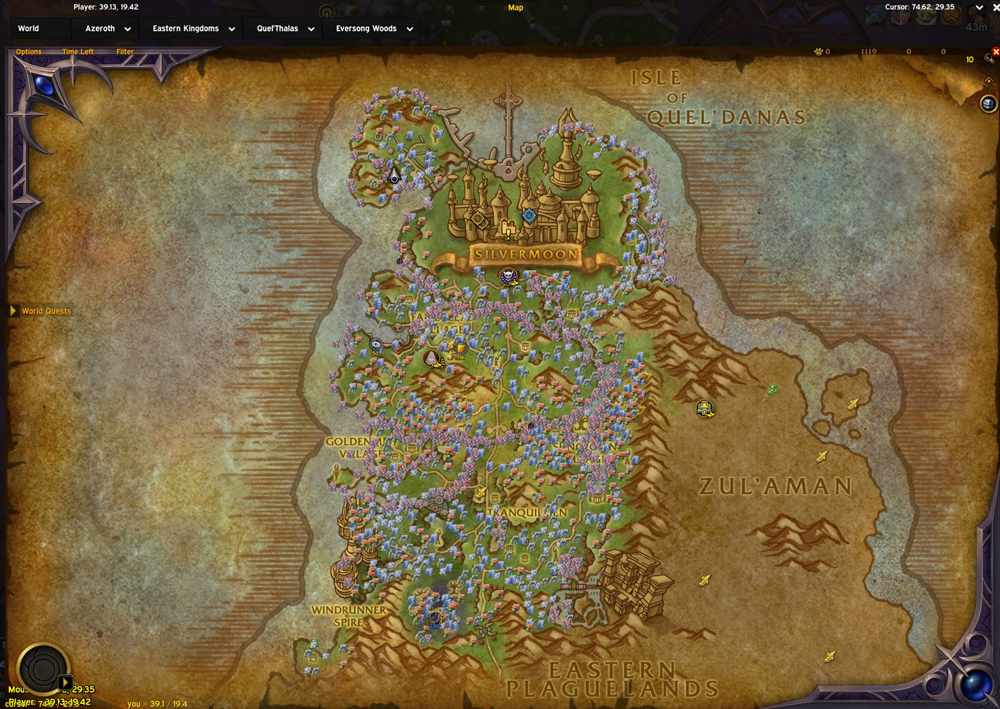
  &nbsp;
  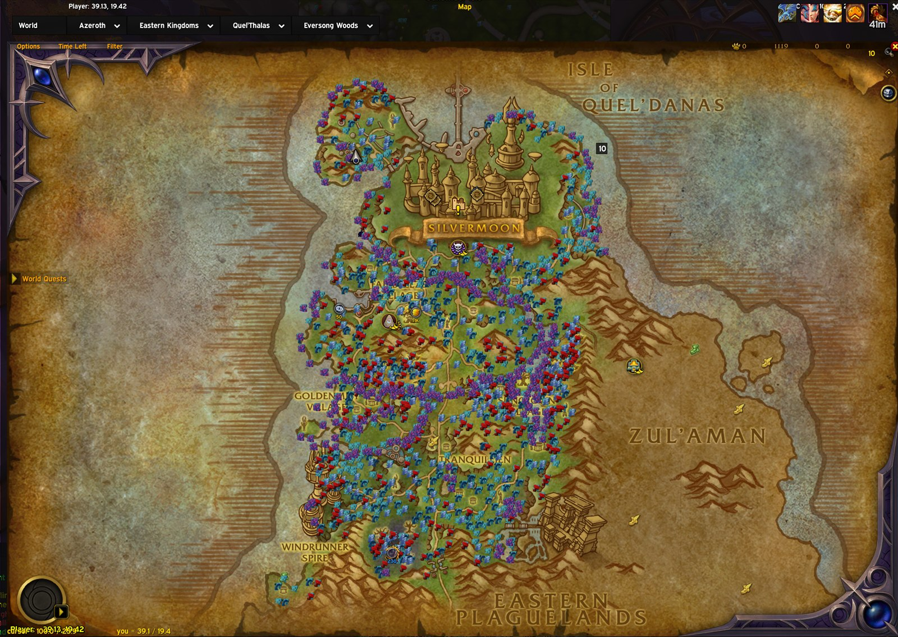
  &nbsp;
  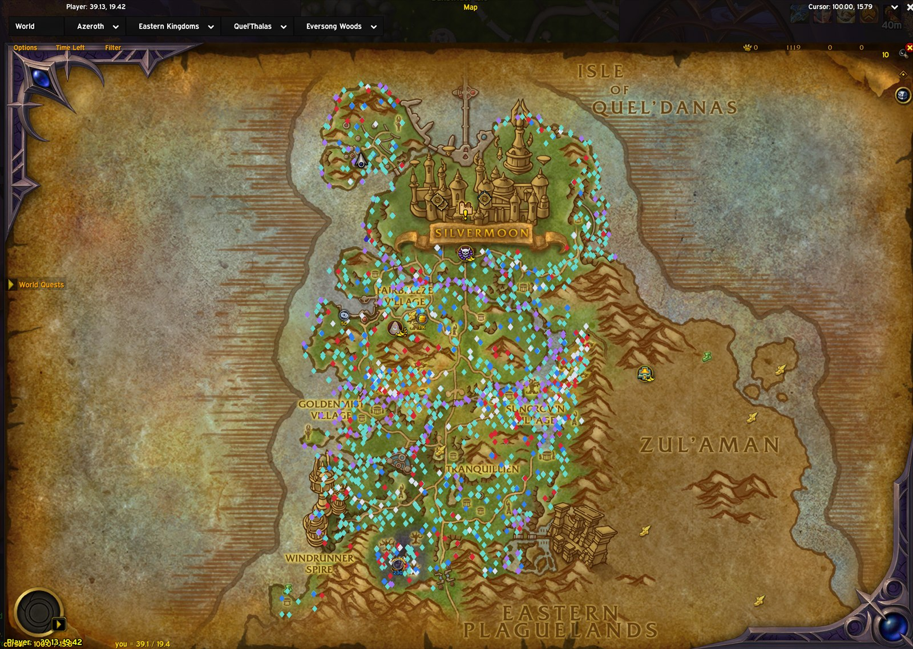
</p>

<p align="center"><em>Same zone, same progression: GatherMate2 default → GMNT default → GMNT vivid.</em></p>

## Install

### From a release (recommended)

1. Grab the latest `GM2_NodeTint-<version>.zip` from the [Releases page](https://github.com/dbeckett93/GM2_NodeTint/releases).
2. Extract the `GM2_NodeTint` folder inside the zip into `World of Warcraft\_retail_\Interface\AddOns\`.
3. Restart the client (or `/reload` if it's already running).

The release zip contains only the runtime files (Lua, TOC, embedded Ace3, textures, in-game icon). It's ready to drop into the AddOns folder as-is.

### From source

```
git clone https://github.com/dbeckett93/GM2_NodeTint.git "World of Warcraft\_retail_\Interface\AddOns\GM2_NodeTint"
```

The source tree includes development-only files (`.github/`, `Media/`) that the game ignores but that bloat the install slightly compared to the release zip.

## Configure

Open the options panel:

- `/gmnt` (or `/gm2nodetint`) — open settings
- `/gmnt toggle` — flip the master enable
- `/gmnt reset` — reset the active profile

Four tabs.

### General

<p align="center">
  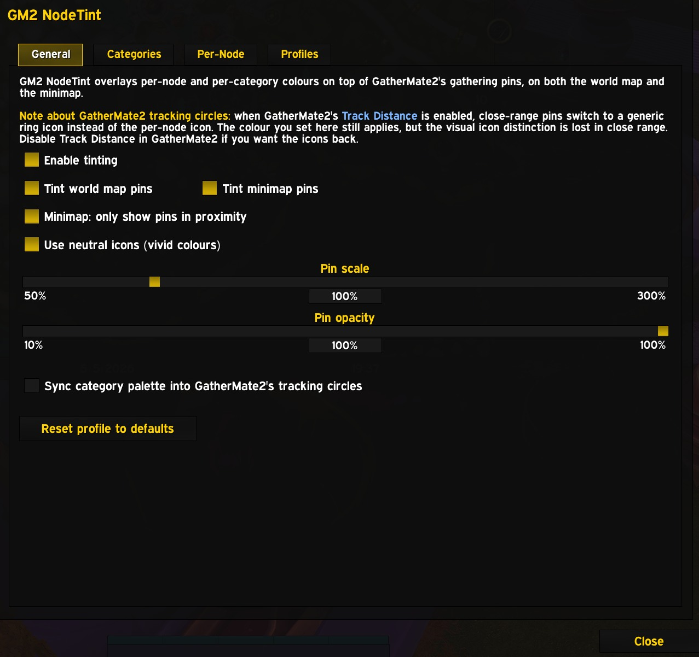
</p>

The master switches and the visual upgrades. Toggle world-map and minimap tinting independently, flip on **Use neutral icons (vivid colours)** for the saturated look, dial **pin scale** and **pin opacity**, gate the minimap to **only show pins in proximity** when you want a quiet view, and optionally **sync your category palette into GatherMate2's tracking circles** so the close-range ring uses the same colours.

### Categories

<p align="center">
  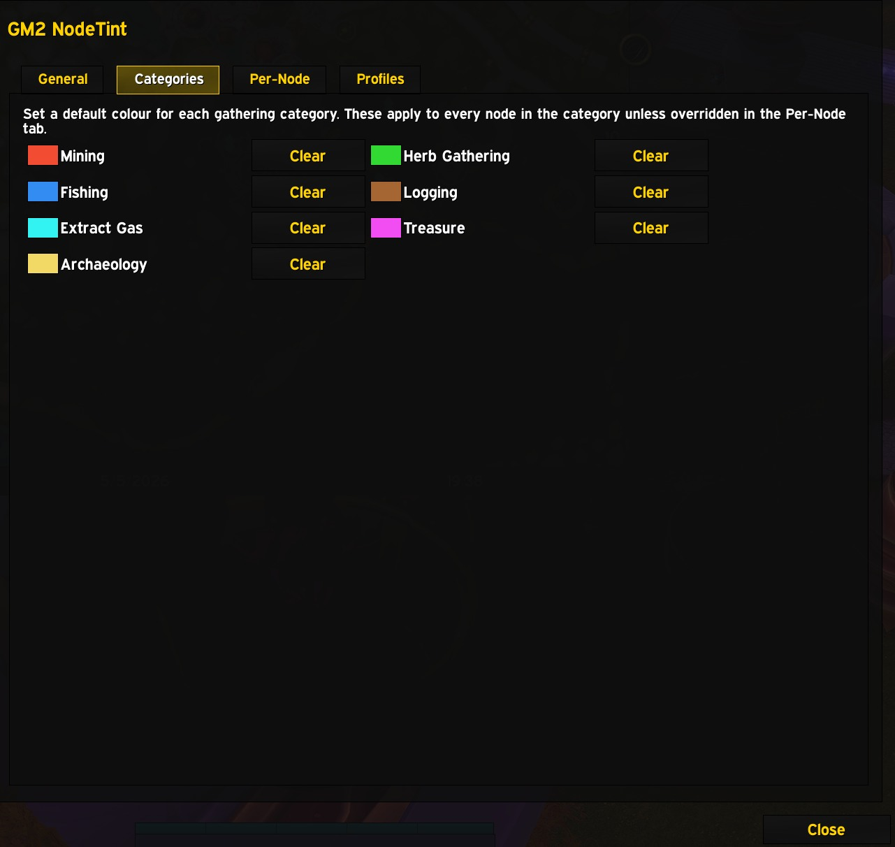
</p>

One swatch per gathering category — Mining, Herb Gathering, Fishing, Logging, Extract Gas, Treasure, Archaeology. The category colour applies to every node in the category unless a per-node override is set.

### Per-Node

<p align="center">
  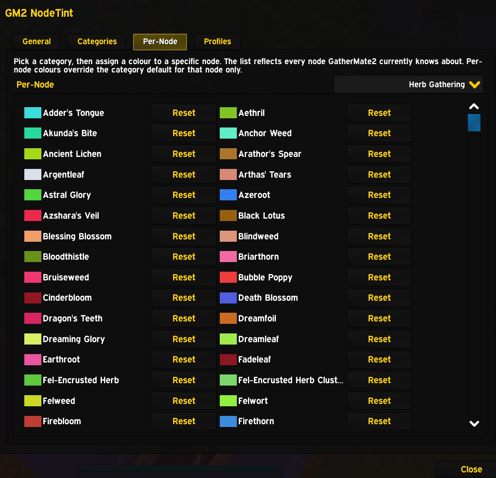
</p>

Drill into a category and assign a specific node its own colour. Defaults are seeded automatically per gathering expansion — Classic warm earth, Wrath icy blue, Shadowlands ethereal purple, Midnight silver-cobalt, and so on — so you start from a sensible palette and only need to tweak the ones you care about. Change anything and the rest stay; reset a node and it picks up the auto-seeded default again on next reload.

### Profiles

<p align="center">
  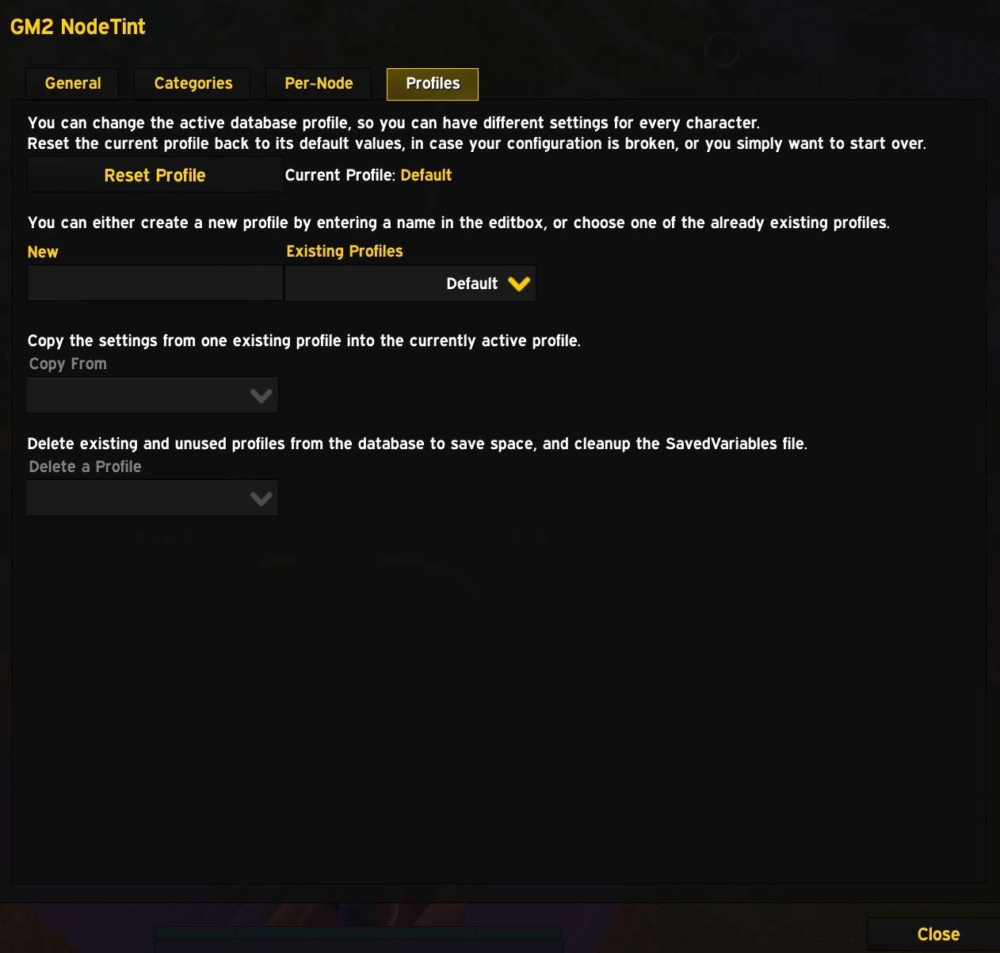
</p>

Standard AceDB profile management — per-character by default, but you can copy a profile to another character or share one palette across your alts in two clicks.

## Pro tips

- **Want colours that punch through the map?** Flip **Use neutral icons (vivid colours)** on. GMNT swaps GatherMate2's pre-coloured icons for white silhouettes before tinting, so your colour reaches the screen at full saturation instead of being muted by the underlying icon hue.
- **Tracking a specific herb on a daily route?** Bump its per-node colour to neon. The rest of the herbs fade into wallpaper and the one you want jumps off the map.
- **Tired of the minimap looking like a sticker book?** Turn on **Minimap: only show pins in proximity**. Pins beyond GatherMate2's tracking distance vanish; only the ones you can actually act on remain.
- **Setting up an alt?** Profiles → New Profile → Copy From → main. Done.

## Caveat: GatherMate2 tracking circles

If GatherMate2's *Track Distance* is on, close-range pins switch to a generic ring icon. GMNT's colour still applies to the ring, but the per-node icon disappears at close range. Turn off Track Distance in GatherMate2 if you'd rather keep the icons.

## Built on GatherMate2

GM2 NodeTint is built entirely on the foundation of [GatherMate2](https://www.curseforge.com/wow/addons/gathermate2). Sincere thanks to the GatherMate2 development team for years of work on data collection, the pin lifecycle, and the public hooks GMNT depends on. None of this exists without their groundwork.

## Licence

MIT.
